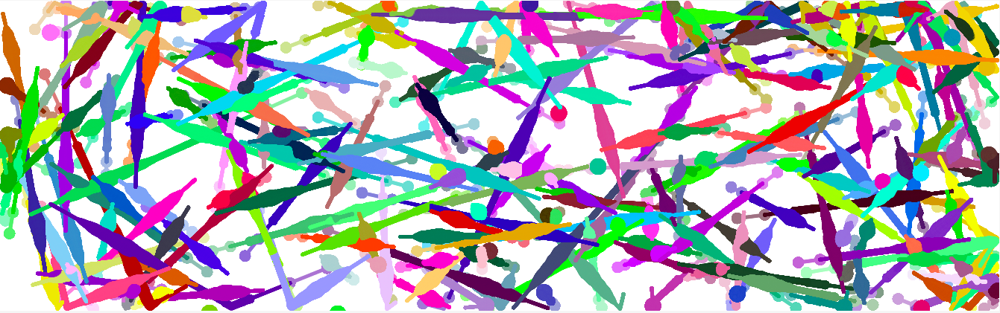
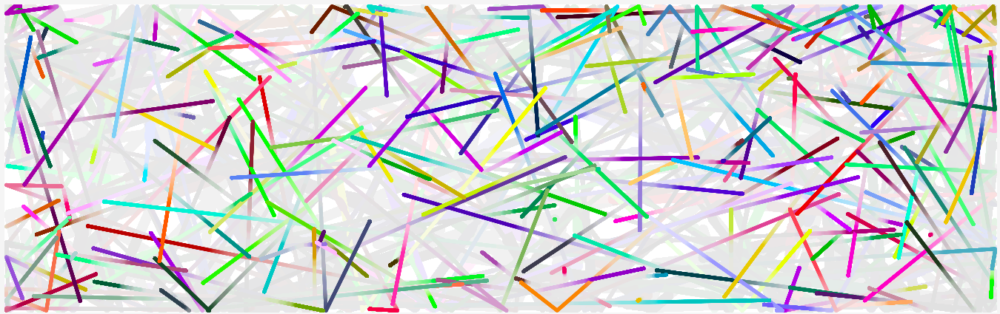

## Noops Challenge 3
### Directbot v1.0

### Instructions
No real instructions, have fun with it. 
- Try varying the size quickly
- Try varying the size gradually

## API Usage
Initial velocity/direction induced through directbot
- UP = +y 
- DOWN = -y
- LEFT = -x
- RIGHT = +x

## Future implementations
- Fetch new directions all at once
- After traveling n, update the direction vector (set by the `distance` key from directbot)

